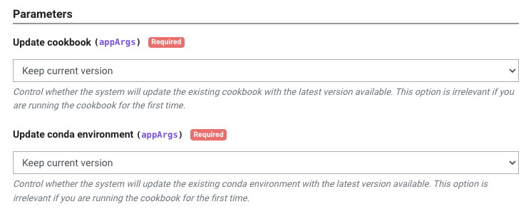

This template is the first in a [series of tutorials](#next-tutorials) that will guide you through the process of creating a cookbook and running it on TACC systems. From simple ones that run a command to more complex ones that run a Python using conda or a Jupyter Notebook.

## Requirements

- A GitHub account
- TACC account. If you don't have one, you can request one [here](https://accounts.tacc.utexas.edu/register)
- To access TACC systems, you should have an [allocation](https://tacc.utexas.edu/use-tacc/allocations/)
  - You can see your allocations [here](https://ptdatax.tacc.utexas.edu/workbench/allocations/approved)
  - If you don't have an allocation, you can request one [here](https://portal.tacc.utexas.edu/allocation-request)

## Template Overview

This template creates a cookbook that runs a Jupyter Notebook stored in the repository. The cookbook will download the Jupyter Notebook, install the required Python packages, and execute the notebook in the TACC cluster.

The environment and notebook are saved on the TACC storage. Therefore, you can resume the execution of the notebook from where it stopped.

### How does it work?

1. [`app.json`](app.json) file: contains the definition of the Tapis application, including the application's name, description, Docker image, input files, and advanced options.
2. [`Dockerfile`](Dockerfile): a Docker image is built from the [`Dockerfile`](./Dockerfile). The Docker image defines the runtime environment for the application and the files that will be used by the application.
3. [`run.sh`](run.sh): contains all the commands that will be executed on the TACC cluster.
4. [`notebook.ipynb`](notebook.ipynb): a Jupyter Notebook that will be executed by the application.
5. [`.binder/requirements.txt`](requirements.txt): a file that contains the Python packages that will be installed in the Docker image.
6. [`.binder/environment.yml`](environment.yml): a file that contains the conda environment that will be installed in the Docker image.

### Job run script

The `run.sh` file is used to run the commands and define important variables for the application.

```bash
#!/bin/bash
export GIT_REPO_URL="https://github.com/In-For-Disaster-Analytics/Cookbook-Jupyter-Template.git"
export COOKBOOK_NAME="cookbook-template-jupyter"
export COOKBOOK_CONDA_ENV="example"
IS_GPU_JOB=false
```

- `GIT_REPO_URL`: the URL of the GitHub repository created from this template.
- `COOKBOOK_NAME`: the name of the cookbook. It will be used to create the directory where the files will be stored.
- `COOKBOOK_CONDA_ENV`: the name of the conda environment that will be created on your TACC account.
- `IS_GPU_JOB`: a boolean variable that defines if the job will run on a GPU node. If you want to run the job on a GPU node, change the value to `true`.

## Create your Cookbook

### Create a new repository

1. Click on the "Use this template" button to create a new repository
2. Fill in the form with the information for your new repository

### Build the Docker image

You can skip this step if you don't want to build the Docker image yourself. You can use the Docker image from the registry. [GPU image](https://github.com/orgs/In-For-Disaster-Analytics/packages/container/package/cookbook-jupyter-template-gpu)
or [CPU image](https://github.com/orgs/In-For-Disaster-Analytics/packages/container/package/cookbook-jupyter-template-cpu)

1. Clone the repository
2. Build the Docker image using the command below

```bash
docker build -t cookbook-juptyer-gpu -f Dockerfile.gpu .
docker build -t cookbook-juptyer-cpu -f Dockerfile.cpu .
```

3. Push the Docker image to a container registry

```bash
docker tag cookbook-juptyer-gpu <your-docker-username>/cookbook-juptyer-gpu
docker push <your-docker-username>/cookbook-juptyer-gpu
docker tag cookbook-juptyer-cpu <your-docker-username>/cookbook-juptyer-cpu
docker push <your-docker-username>/cookbook-juptyer-cpu
```

### Modify the `app.json` file

Each app has a unique `id` and `description`. So, you should change these fields to match your app's name and description.

1. Download the `app.json` file
2. Change the values `id` and `description` fields with the name and description as you wish.
3. If you built the Docker image, change the `containerImage` field with the image name you used.

### Create a New Application on the Cookbook UI

1. Go to [Cookbook UI](https://in-for-disaster-analytics.github.io/cookbooks-ui/#/apps)
2. Click on the "Create Application" button
3. Fill in the form with the information from your `app.json` file
4. Click "Create Application"
5. A new application will be created, and you will be redirected to the application's page

### Run your Cookbook

1. Go to the application's page on the Cookbook UI, if you are not already there
2. Click on the "Run" button on the right side of the page. This will open the Portal UI
3. Select the parameters for your job

   

- Update cookbook: Control whether the system will update the existing cookbook with the latest version available. This option is irrelevant if you are running the cookbook for the first time.
- Update conda environment: Control whether the system will update the existing conda environment with the latest version available. This option is irrelevant if you are running the cookbook for the first time.

### Access the notebook

1. Go to the Jobs tab
2. Wait for the job to be ready
3. Click in the `Open session` button

   

## Next templates

- [Running a command](https://github.com/In-For-Disaster-Analytics/Cookbook-Docker-Template)
- [Running a Python script using conda](https://github.com/In-For-Disaster-Analytics/Cookbook-Conda-Template)
- [Running a Jupyter Notebook](https://github.com/In-For-Disaster-Analytics/Cookbook-Jupyter-Template)

## Authors

William Mobley - wmobley@tacc.utexas.edu
Maximiliano Osorio


## Notes from 2024-11-18 workshop

### WARNING - rename repo in all lowercase

- fork repo
- clone to desktop
- find out the github version for the commit that is under actions on Github.com
-- example code will be something like `1498b2d`
- edit file 'app-cpu.json'
-- line 2: `"id": "cookbook-setx-tacc`, this can be any name
-- line 3: `"version": "0.0.1:sha-1498b2d"`
-- line 10: `""containerImage": "docker://ghcr.io/npr99/cookbook-setx-tacc:sha-1498b2d"`
-- line 144: `    "label": "Cookbook-SETX tutorial - Jupyter Lab (CPU)",`
-- line 149: `    "queueFilter": ["vm-small"]`
--- Will explained that line 149 has several options vm-small is easy to get because it has fewer cores maybe...

- edit file run.sh
-- line 9: `export GIT_REPO_URL="https://github.com/npr99/cookbook-setx-tacc.git"`
-- line 10: `export COOKBOOK_NAME="Cookbook-SETX-TACC Tutorial"`

Log into TACC website https://in-for-disaster-analytics.github.io/cookbooks-ui/#/login
- create a new application
- locate the app-cpu.json file and open
- select run and set allocation to PT2050-DataX
- login password and TACC token is from DUO multi factor (set up in advance)

Commit changes to Github
- get the new unique id for actions different from the previous version 8a74db5

Edit lines 3 and 10 in app-cpu.json to reflect the new unique id